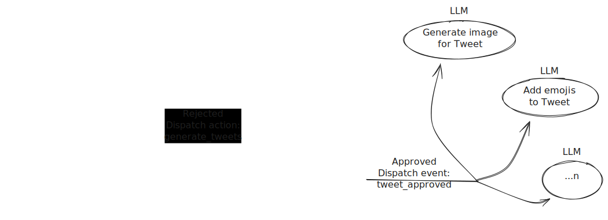

# Serverless AI Workflow with Less

**This project was created live during a [YouTube livestream](https://www.youtube.com/watch?v=NuI18jQZ1m8&t=3315s).** Watch the session to see the full development process, design decisions, and a walkthrough of Less in action.

The goal of the livestream was to demonstrate how to connect various LLM prompts together to create an AI workflow with or without human intervention or participation. This project is using AWS API Gateway, SNS, SQS, Lambdas, DynamoDB, and more under the hood.

---

## Project Diagram

We'll be working towards more or less the following architecture:


## Project Structure

```
less/                                 # Less serverless AWS resources
  apis/                               # API Gateways
    ai/trigger/get.js                 # GET /trigger in AI API
    webhooks/sendgrid/post.js         # POST /sendgrid in Webhooks API
  shared/helpers/                     # Shared utility functions
  topics/                             # Topics/Processors (Pub/Sub) and Commands
    generate_tweets/process/index.js  # Generate Tweets command
    make_it_fun/process/index.js      # Make It Fun command
less.config                           # Less Config for environment variables
package.json
Tasks.md                              # Project tasks and roadmap
```

## Prerequisites

- [Node.js](https://nodejs.org/)
- A [Less account](https://less.chuva.io/sign-in-sign-up)
- [OpenRouter](https://openrouter.ai/) API keys
- [SendGrid](https://sendgrid.com/) API keys (optional for sending email)

## Setup Environment Variables

Create a `.env` file in the project root with the following variables:

```
OPENROUTER_API_KEY=your_openrouter_api_key
SENDGRID_API_KEY=your_sendgrid_api_key      # Optional
AI_EMAIL_ADDRESS=your_ai_agent_email@domain.com      # Optional
```

## Build and Run Locally

1. Build and run the project locally with Less:
   ```sh
   npm i
   npx @chuva.io/less-cli build ai-workflow-demo
   npx @chuva.io/less-cli run ai-workflow-demo
   ```

## Deploy to AWS with Less

1. Create a Less Account [here](https://less.chuva.io/sign-in-sign-up)
1. Deploy your project with a single command:

   ```sh
   npx @chuva.io/less-cli deploy ai-workflow-production
   ```
